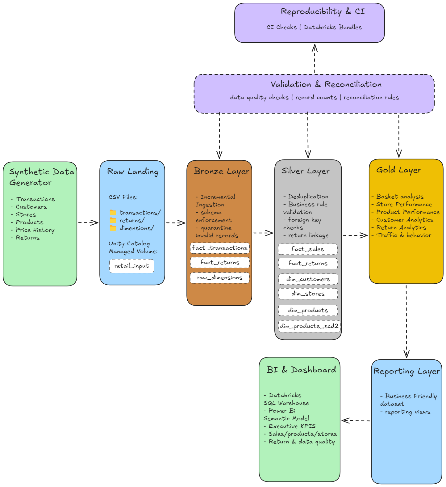
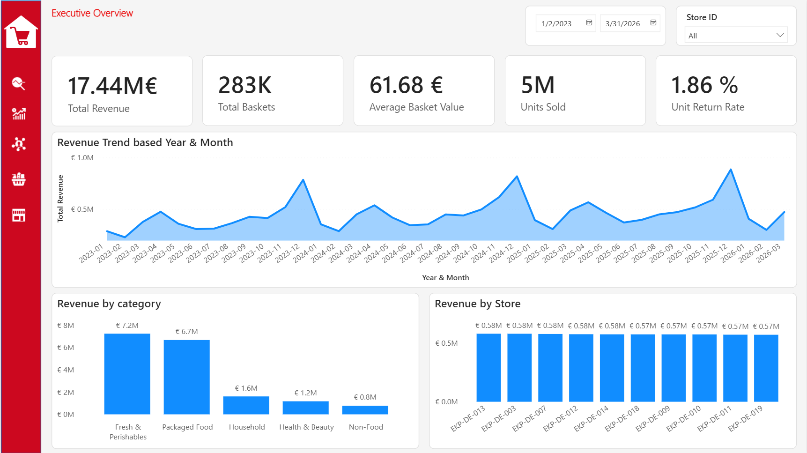
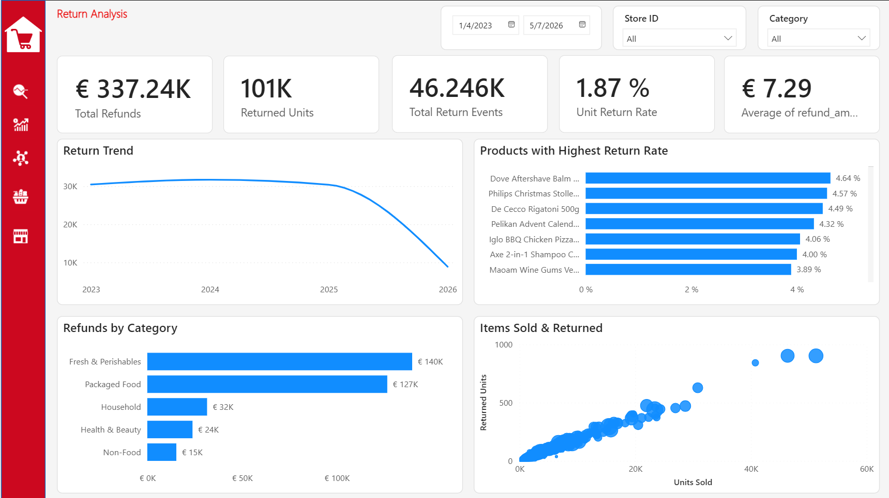
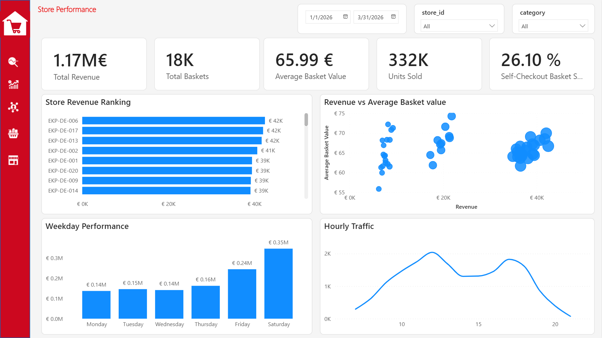
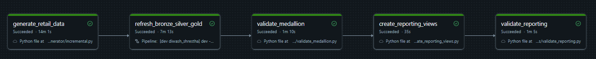

# Einkaufpark Retail Analytics Platform

Einkaufpark is a data engineering project for a fictional multi-store retailer, **EinkaufPark**. A Python-based data generator creates transactions, customers, stores, products, price changes, promotions, and returns. These events are landed in a Unity Catalog Volume and processed through a Databricks Medallion Architecture.

The data flows through a **Bronze → Silver → Gold** architecture, where raw events are progressively validated, cleaned, and transformed into analytics-ready datasets.

The idea behind it is simple: a useful data platform has to deal with more than clean CSV files.

Retail data can arrive late. Records can be duplicated. Customers can be anonymous. Product prices change over time. Returns happen days after the original purchase. Some records are technically readable but still fail business rules.

This project is about handling those problems before someone starts making decisions from the numbers.

## Architecture

<!-- Add pipeline architecture image here -->




## Technology

| Area | Technology | Why it is here |
|---|---|---|
| Programming | Python | Data generation, validation, and orchestration helpers |
| Transformation | PySpark / Spark SQL | Distributed transformations and analytical logic |
| Storage | Delta Lake | Managed analytical tables |
| Data platform | Databricks | Compute, jobs, SQL, pipelines, and governance |
| Pipelines | Lakeflow Declarative Pipelines | Bronze → Silver → Gold execution |
| Governance | Unity Catalog | Schemas and managed input Volume |
| Deployment | Databricks Asset Bundles | Source-controlled resources and environments |
| Analytics | Power BI | Semantic model and dashboard |
| Testing | pytest | Generator, bundle, Silver, and Gold contracts |
| CI | GitHub Actions | Syntax, configuration, and unit checks |
| Version control | Git / GitHub | Code, platform configuration, and PBIP source |


## Project Covers

The project currently covers:

- deterministic synthetic retail data generation
- customers, stores, products, transactions, and returns
- promotions and product price changes
- anonymous walk-in customers
- duplicate records
- late-arriving records
- Bronze ingestion and quarantine
- trusted Silver facts and dimensions
- SCD Type 2 product price history
- return-to-purchase validation
- business and financial data-quality checks
- Gold analytical models
- revenue and row-count reconciliation
- incremental source batches
- manifest-based batch tracking
- reporting views for Power BI
- a source-controlled Power BI project
- unit and contract tests
- GitHub Actions CI
- Databricks Asset Bundle deployment

The data generator also includes scenarios such as duplicates, late-arriving data, promotions, walk-in customers, returns, and product price changes. This allows the pipeline to be tested against imperfect data rather than only clean examples.

# How the data moves through the platform

## 1. Synthetic source data

The project starts with a Python-based retail data generator.

Important files include:

```text
data_generator/
├── generator.py
├── incremental.py
├── price_history.py
├── product_catalogue.py
└── progress.py
```

The generator produces data for stores, terminals, customers, products, transactions, baskets, returns, promotions, and product price history.

Reference data used during generation lives under:

```text
master/
├── raw_schema.json
├── store_master.json
└── terminal_master.json
```

The generator deliberately introduces conditions the pipeline must handle, including late arrivals, duplicates, walk-in customers, returns, promotions, and price changes.

A fixed random seed makes the generated dataset reproducible.

### Default demo configuration

The bundle currently uses:

| Parameter | Default |
|---|---:|
| Transaction lines | 2,000,000 |
| Customers | 50,000 |
| Seed | 42 |
| Start date | 2023-01-01 |
| End date | 2026-03-31 |
| Price-history end | 2026-12-31 |
| Walk-in rate | 10% |
| Late-arrival rate | 5% |
| Return rate | 4% |
| Duplicate rate | 0.1% |

These are defaults, not hard-coded limits.

For example, a larger demo can be started with:

```bash
databricks bundle run retail_medallion_job \
  --target dev \
  --params mode=demo,records=500000,customers=25000,start_date=2023-01-01,end_date=2026-03-31,seed=42
```

---

## 2. Raw landing zone

Generated files are written to a managed Unity Catalog Volume.

For the development target, the defaults are:

```text
catalog: workspace
schema:  retail_dev_raw
volume:  retail_input
```

The generator manages folders for:

```text
dimensions/
transactions/
returns/
_manifests/
_staging/
```

Files are staged before publication. A manifest acts as the commit record for each generated batch, which makes published input traceable and lets exact reruns behave safely.

---

## 3. Bronze

Bronze is the ingestion boundary.

The goal here is not to make the data analytically perfect. The goal is to preserve incoming information, type it, and separate records that cannot safely continue.

```text
Incoming record
      │
      ├── structurally usable ─────► Bronze
      │
      └── invalid / malformed ─────► Quarantine
```

This gives the pipeline somewhere explicit to put bad data instead of silently dropping it.

The Bronze implementation starts in `pipelines/00_bronze.sql`.

Additional documentation lives in [`docs/bronze-layer.md`](docs/bronze-layer.md).

<!-- Recommended screenshot:
     docs/images/lakeflow-pipeline.png
     Place a screenshot of the Lakeflow Bronze/Silver/Gold DAG here. -->

---

## 4. Silver

Silver turns readable source records into trusted business entities.

Relevant pipeline files are:

```text
pipelines/
├── 10_silver_dimensions.sql
├── 11_silver_sales.sql
├── 12_silver_returns.sql
└── 13_silver_quality.sql
```

This layer handles duplicate logic, referential integrity, pricing consistency, revenue checks, return-to-purchase relationships, return-window validation, trusted fact construction, and Silver quality gates.

Product price history is modeled using SCD Type 2 so transactions can be checked against the price that was valid at the time of the sale.

More detail is available in [`docs/silver-layer.md`](docs/silver-layer.md).

---

## 5. Gold

Gold contains reusable analytical models built from trusted Silver data.

```text
pipelines/
├── 20_gold_baskets.sql
├── 21_gold_sales_stores.sql
├── 22_gold_products.sql
├── 23_gold_customers_returns_traffic.sql
└── 24_gold_quality.sql
```

The models cover basket behavior, daily sales, store performance, product performance, customer lifetime value, returns analysis, hourly traffic, and data-quality reconciliation.

The goal is to keep reusable business logic in the data platform instead of rebuilding it separately in every Power BI visual.

---

## 6. Validation and reconciliation

A pipeline run is not considered trustworthy simply because Spark finished without throwing an exception.

The project validates the resulting data as well.

```text
scripts/
├── validate_medallion.py
└── validate_reporting.py
```

Silver and Gold contain explicit quality checks, while Gold includes reconciliations that compare analytical outputs back to trusted sources.

That distinction matters:

```text
"the job succeeded"
```

and

```text
"the numbers reconcile"
```

are not the same thing.

This project checks both.

---

## 7. Reporting layer

Power BI does not need to know about every internal Silver or Gold implementation detail.

A reporting layer sits between the data platform and the semantic model:

```text
Silver / Gold
      │
      ▼
Reporting Views
      │
      ▼
Power BI
```

The views are defined in `sql/reporting_views.sql` and currently include:

```text
v_fact_sales
v_fact_returns

v_dim_date
v_dim_store
v_dim_product
v_dim_customer

v_executive_kpis
v_daily_sales
v_store_performance
v_product_performance
v_customer_ltv
v_returns_analysis
v_hourly_traffic
v_data_quality_summary
```

This reporting contract gives the BI layer a more stable interface and keeps Power BI from depending directly on every internal transformation table.

The views are created by `scripts/create_reporting_views.py` and checked by `scripts/validate_reporting.py`.

---

## 8. Power BI

The BI project lives under:

```text
powerbi/
├── retail_chain_dashboard.pbip
├── retail_chain_dashboard.Report/
├── retail_chain_dashboard.SemanticModel/
├── einkaufpark-fluent2.json
└── Theme.json
```

The project uses Power BI Project (`.pbip`) format instead of keeping only a binary `.pbix`. That makes the report definition and semantic model much easier to keep in Git alongside the rest of the platform.






To open the report:

1. Install Power BI Desktop.
2. Open `powerbi/retail_chain_dashboard.pbip`.
3. Make sure the Databricks data-source credentials are valid.
4. Use **Home → Refresh** after the Databricks pipeline has completed.


# Databricks architecture

The bundle creates five logical schemas:

```text
Raw
 ↓
Bronze
 ↓
Silver
 ↓
Gold
 ↓
Reporting
```

The development target uses:

```text
workspace.retail_dev_raw
workspace.retail_dev_bronze
workspace.retail_dev_silver
workspace.retail_dev_gold
workspace.retail_dev_reporting
```

The release target uses:

```text
workspace.retail_raw
workspace.retail_bronze
workspace.retail_silver
workspace.retail_gold
workspace.retail_reporting
```

The same source code is used for both environments. Environment-specific names live in `databricks.yml` instead of separate copies of the pipeline.

---

# Orchestration

The main Databricks job is `retail_medallion_job`.

It executes the platform in order:

```text
generate_retail_data
        │
        ▼
refresh_bronze_silver_gold
        │
        ▼
validate_medallion
        │
        ▼
create_reporting_views
        │
        ▼
validate_reporting
```

A downstream task only starts after its dependency succeeds.

The job definition lives in `resources/retail_job.yml`. The Lakeflow pipeline is defined in `resources/medallion_pipeline.yml`. Unity Catalog schemas and the managed input Volume are defined in `resources/unity_catalog.yml`.



---

# Repository structure

```text
retail_analytics_pipeline/
│
├── .github/
│   └── workflows/
│       └── ci.yml
│
├── data_generator/
│   ├── generator.py
│   ├── incremental.py
│   ├── price_history.py
│   ├── product_catalogue.py
│   └── progress.py
│
├── docs/
│   ├── bronze-layer.md
│   └── silver-layer.md
│
├── master/
│   ├── raw_schema.json
│   ├── store_master.json
│   └── terminal_master.json
│
├── pipelines/
│   ├── 00_bronze.sql
│   ├── 10_silver_dimensions.sql
│   ├── 11_silver_sales.sql
│   ├── 12_silver_returns.sql
│   ├── 13_silver_quality.sql
│   ├── 20_gold_baskets.sql
│   ├── 21_gold_sales_stores.sql
│   ├── 22_gold_products.sql
│   ├── 23_gold_customers_returns_traffic.sql
│   └── 24_gold_quality.sql
│
├── powerbi/
│   ├── retail_chain_dashboard.pbip
│   ├── retail_chain_dashboard.Report/
│   ├── retail_chain_dashboard.SemanticModel/
│   ├── einkaufpark-fluent2.json
│   └── Theme.json
│
├── resources/
│   ├── medallion_pipeline.yml
│   ├── retail_job.yml
│   └── unity_catalog.yml
│
├── scripts/
│   ├── create_reporting_views.py
│   ├── deploy_dev.sh
│   ├── validate_medallion.py
│   └── validate_reporting.py
│
├── sql/
│   └── reporting_views.sql
│
├── tests/
│   ├── unit/
│   ├── sql/
│   └── test_pipeline_contracts.py
│
├── databricks.yml
├── requirements-dev.txt
├── pipeline_image.png
└── README.md
```


# Getting started

## Prerequisites

You will need:

- Git
- Python 3.11+
- Databricks CLI with Asset Bundle support
- access to a Databricks workspace
- Unity Catalog support in that workspace
- Power BI Desktop if you want to open the dashboard

The development Python dependencies are deliberately small:

```text
pytest
pyyaml
```

They are listed in `requirements-dev.txt`.

---

## 1. Clone the repository

```bash
git clone https://github.com/diwashrestha/retail_analytics_pipeline.git
cd retail_analytics_pipeline
```

## 2. Create a Python environment

On Linux/macOS:

```bash
python -m venv .venv
source .venv/bin/activate
```

On Windows PowerShell:

```powershell
python -m venv .venv
.venv\Scripts\Activate.ps1
```

Install the dependencies:

```bash
python -m pip install --upgrade pip
pip install -r requirements-dev.txt
```

## 3. Authenticate Databricks

The project does not require a `.env` file. Databricks authentication is handled through the Databricks CLI.

Configure a CLI profile for your workspace and verify the connection:

```bash
databricks current-user me --profile <your-profile>
```

The helper script `scripts/deploy_dev.sh` uses `einkaufpark-free` as its default profile. Override it with:

```bash
export DATABRICKS_PROFILE=<your-profile>
```

No credentials should be committed to the repository.

## 4. Run the local tests

```bash
python -m pytest tests/unit -q
```

The current unit suite covers bundle configuration, generator behavior, Silver contracts, and Gold contracts.

There are also additional test assets under `tests/`, including SQL tests and `test_pipeline_contracts.py`. The current GitHub Actions workflow runs `tests/unit`.

## 5. Validate the Databricks bundle

```bash
databricks bundle validate \
  --target dev \
  --profile <your-profile>
```

## 6. Deploy the development environment

```bash
databricks bundle deploy \
  --target dev \
  --profile <your-profile>
```

## 7. Run the complete platform

```bash
databricks bundle run \
  retail_medallion_job \
  --target dev \
  --profile <your-profile>
```

With no additional parameters, the job uses the defaults in `databricks.yml`.

The run performs:

```text
generate the demo data
        ↓
refresh Bronze / Silver / Gold
        ↓
validate the medallion model
        ↓
create reporting views
        ↓
validate the reporting layer
```

---


# Controlling generated data

The job exposes runtime parameters including:

```text
mode
records
customers
seed
start_date
end_date
price_history_end_date
walkin_rate
late_rate
return_rate
duplicate_rate
```

For example:

```bash
databricks bundle run retail_medallion_job \
  --target dev \
  --params mode=demo,records=500000,customers=25000,start_date=2023-01-01,end_date=2026-03-31,seed=42
```

The behavior parameters are rates. For example:

```text
walkin_rate=0.10
late_rate=0.05
return_rate=0.04
duplicate_rate=0.001
```

represent approximately:

```text
10% walk-in behavior
5% late-arrival behavior
4% return behavior
0.1% duplicate injection
```

These scenarios exist so the pipeline can be tested against imperfect input instead of only clean examples.

---

# Demo, incremental, and reset modes

The generator supports three modes.

## `demo`

Creates the initial deterministic baseline.

A demo run deliberately refuses to overwrite existing published landing data. Rebuilding the baseline should be explicit rather than something that happens accidentally.

## `incremental`

Adds a new non-overlapping business-date range to an existing baseline.

Example:

```bash
databricks bundle run retail_medallion_job \
  --target dev \
  --params mode=incremental,records=5000,start_date=2026-04-01,end_date=2026-04-03
```

Existing dimensions and product price history are reused.

Published manifests track batches, reject overlapping date ranges, and make exact reruns safe.

## `reset`

The Python generator supports a reset mode that removes only generator-owned landing directories.

For a local landing zone:

```bash
python data_generator/incremental.py \
  --mode reset \
  --output-dir data/raw
```

Be careful with reset operations in Databricks.

The current `retail_medallion_job` is an end-to-end workflow. After its generator task succeeds, it continues into Bronze, Silver, Gold, and validation. It is therefore not a reset-only job.

A dedicated Databricks reset workflow, if added, should remain separate from the normal processing job.

---

# Running the generator locally

The generator can be exercised independently of Databricks:

```bash
python data_generator/incremental.py \
  --mode demo \
  --records 100000 \
  --customers 10000 \
  --seed 42 \
  --start-date 2023-01-01 \
  --end-date 2026-03-31 \
  --price-history-end-date 2026-12-31 \
  --output-dir data/raw \
  --master-dir master
```

This is useful when working on generation logic or generator tests without running the full Databricks platform.

The full Bronze → Silver → Gold → Reporting workflow still requires Databricks.
